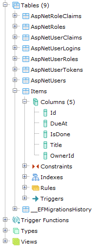

## PostgreSQL

Using PostgreSQL for your application instead of SQLite will allow it to support foreign key relationships with Entity Framework Core, allow it to scale better, and give you access to various PostgreSQL features like the [PostGIS extension](https://postgis.net/).

Thanks to the layer of abstraction we get from using Entity Framework Core, modifying our application to use a different database engine is less complex than you would think. We can use our existing models, only having to change the Entity Framework Core provider we use. We will add the [Npgsql EF Core provider](http://www.npgsql.org/efcore/index.html).

### Add provider Nuget package

To add the package, run the following command:

```
dotnet add package Npgsql.EntityFrameworkCore.PostgreSQL
```

After adding the package, you will notice the project's `.csproj` file being updated to reflect the new list of packages:

```xml
<ItemGroup>
  <PackageReference Include="Humanizer" Version="2.2.0" /> <!-- Added earlier -->
  <PackageReference Include="Microsoft.AspNetCore.All" Version="2.0.3" />
  <PackageReference Include="Microsoft.EntityFrameworkCore.Tools" Version="2.0.1" PrivateAssets="All" />
  <PackageReference Include="Microsoft.VisualStudio.Web.CodeGeneration.Design" Version="2.0.1" PrivateAssets="All" />
  <PackageReference Include="Npgsql.EntityFrameworkCore.PostgreSQL" Version="2.0.1" /> <!-- Added now -->
</ItemGroup>
```

### Modify configuration

In the project's `Startup.cs` file, modify the `ConfigureServices` method to replace the following code that enabled the SQLite provider:

```csharp
services.AddDbContext<ApplicationDbContext>(options =>
    options.UseSqlite(Configuration.GetConnectionString("DefaultConnection")));
```

with the following code to instead enable the PostgreSQL provider:

```csharp
services.AddEntityFrameworkNpgsql().AddDbContext<ApplicationDbContext>(options =>
    options.UseNpgsql(Configuration.GetConnectionString("DefaultConnection")));
```  

The connection string `DefaultConnection` will also have to be updated to reflect connecting to a PostgreSQL database instead of SQLite. Modify the `appsettings.json` file in the project root to change the following connection string:

```
"ConnectionStrings": {
  "DefaultConnection": "DataSource=app.db"
}
```

to a new connection string for PostgreSQL:

```
"ConnectionStrings": {
  "DefaultConnection": "Server=localhost;Port=5432;User Id=username;Password=secret;Database=todos;"
}
```

### Starting a PostgreSQL database

Setting up PostgreSQL on your development machine is outside of the scope of this book. You can install and start PostgreSQL any way you like, however, a convenient modern way of doing this is using Docker. With [Docker installed](https://docs.docker.com/install/) on your machine, you can create and run a container from the [`Postgres`](https://hub.docker.com/_/postgres/) image, using environment variables to set the username, password, and database used in the connection string set above. To do so, use the following command:

```
docker run -d -e POSTGRES_USER=username -e POSTGRES_PASSWORD=secret -e POSTGRES_DB=todos -p 5432:5432 --name postgres-todos postgres:latest
```

At this point, the container is running and is exposing port `5432` so that the running ASP.NET Core application and tools like pgAdmin can connect to it at `localhost`.

### Updating the database

At this point, we can update the database with the same command we used before:

```
dotnet ef database update
```

While it is true that the migrations we created in the project have already been applied, they were applied when the project was configured to use SQLite. Entity Framework Core knows that with this new database configuration, the migrations have not yet been applied, so it applies them to the PostgreSQL database, resulting in the tables being created. You can use a program like [pgAdmin](https://www.pgadmin.org/) to connect to the database and see the tables that were created:



At this point, you can start your application, visit `localhost:5000` in your browser, and create and manipulate `Todo` items just like before, except this time the data is being saved in the PostgreSQL database. Notice how everything works as before, including:

* Model validation
* Identity authentication and authorization
* etc

without having to change any code except load a different Entity Framework Core provider in `Startup.cs`.